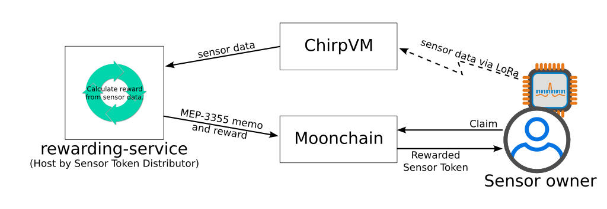

# Twitter Reporter

Welcome to the Twitter Reporter project! This application leverages the Moonchain data and uses a Large Language Model (LLM) to generate insightful reports that are then published to Twitter. The workflow involves collecting data, processing it, and interacting with the Ragflow API for report generation.

## Workflow Diagram
Below is the workflow diagram illustrating the interactions between the various components in the system:

## Overview

The primary components of this project include:

- **Data Collection**: Gathering performance metrics from the Moonchain API.
- **Data Processing**: Formatting the collected data for the LLM.
- **Report Generation**: Using the LLM to create detailed reports.
- **Twitter Posting**: Publishing the generated reports to Twitter.

## Knowledge Base

The `about.txt` file serves as a knowledge base that should be uploaded to Ragflow. This file contains essential information about the project and its objectives, which can help guide the LLM in generating relevant reports.

## Output Handling

Before executing the application, ensure that the CSV files in the `output` folder are deleted. This prevents any conflicts with previously generated reports and ensures that only the latest data is used.

## Getting Started

Clone the repository to your local machine.
    Set up a virtual environment and install the required dependencies.
    Ensure that you have the necessary API keys and tokens configured in your environment.
    Upload the about.txt knowledge base to Ragflow.
    Clear the output folder of any existing CSV files.
    Run the main script to collect data, generate reports, and publish them to Twitter.